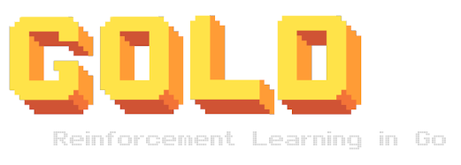

   
   
[](https://godoc.org/github.com/aunum/gold)
[](https://goreportcard.com/report/github.com/aunum/gold)

## Overview 
Gold is a reinforcement learning library for Go. It provides a set of agents that can be used to solve challenges in various environments. The library further contains a composable tooling for creating agents and visualizing their performance.

## Quick Start
```
go run ./pkg/v1/agent/deepq/experiments/cartpole/main.go
```

### Requirements
- Go >= v13.0
- Docker
- A browser that isn't IE

## Agents
All of the agent implementations can be found in [pkg/v1/agent](./pkg/v1/agent) each agent has an experiments folder providing demos across various environments.

|agent|algorithm|
|---|---|
|[pkg/v1/agent/q](./pkg/v1/agent/q)| [Q Learning](https://en.wikipedia.org/wiki/Q-learning)|
|[pkg/v1/agent/deepq](./pkg/v1/agent/deepq)| [Deep Q learning](https://arxiv.org/abs/1312.5602) with [Double Q](https://arxiv.org/abs/1509.06461)|
|[pkg/v1/agent/reinforce](./pkg/v1/agent/reinforce)| [REINFORCE](http://www-anw.cs.umass.edu/~barto/courses/cs687/williams92simple.pdf) aka Monte Carlo Policy Gradients |
|[pkg/v1/agent/nes](./pkg/v1/agent/nes)| [Natural Evolution Strategies](http://www.jmlr.org/papers/volume15/wierstra14a/wierstra14a.pdf)|
|[pkg/v1/agent/her](./pkg/v1/agent/her)| [Hindsight Experience Replay](https://arxiv.org/pdf/1707.01495.pdf)|
|[pkg/v1/agent/ppo](./pkg/v1/agent/ppo)|[Proximal Policy Optimization](https://arxiv.org/pdf/1707.06347.pdf) ⚠️ in progress |

## Docs
Each package contains a README explaining the usage, also see [GoDoc](https://godoc.org/github.com/aunum/gold).

## Contributing
Please open an MR for any issues or feature requests.

The project is fairly simple to hack on, environments are provided through [Sphere](http://github.com/aunum/sphere), models are provided through [Goro](http://github.com/aunum/goro).

Feel free to ping @pbarker on Gopher slack.

## Roadmap
- [ ] More agents, more environments; see [Future Thoughts](./docs/future_thoughts.md)
- [ ] Accelerated compute support 
- [ ] Tuning libraries
- [ ] Deployments

## Inspiration
- [OpenAI Baselines](https://github.com/openai/baselines)
- [The Gorgonia Project](https://gorgonia.org)
- [Gonum](https://www.gonum.org/)
- [RL Overview](https://lilianweng.github.io/lil-log/2018/02/19/a-long-peek-into-reinforcement-learning.html) by Lilian Weng
- [Open Endedness](https://www.oreilly.com/radar/open-endedness-the-last-grand-challenge-youve-never-heard-of) by Kenneth O. Stanley, Joel Lehman and Lisa Soros
- [AI-GAs](http://www.evolvingai.org/files/1905.10985.pdf) by Jeff Clune
- [The Bitter Lesson](http://incompleteideas.net/IncIdeas/BitterLesson.html) by Rich Sutton
- [Reinforcement Learning: An Introduction](http://incompleteideas.net/book/the-book-2nd.html) by Rich Sutton and Andrew Barto
