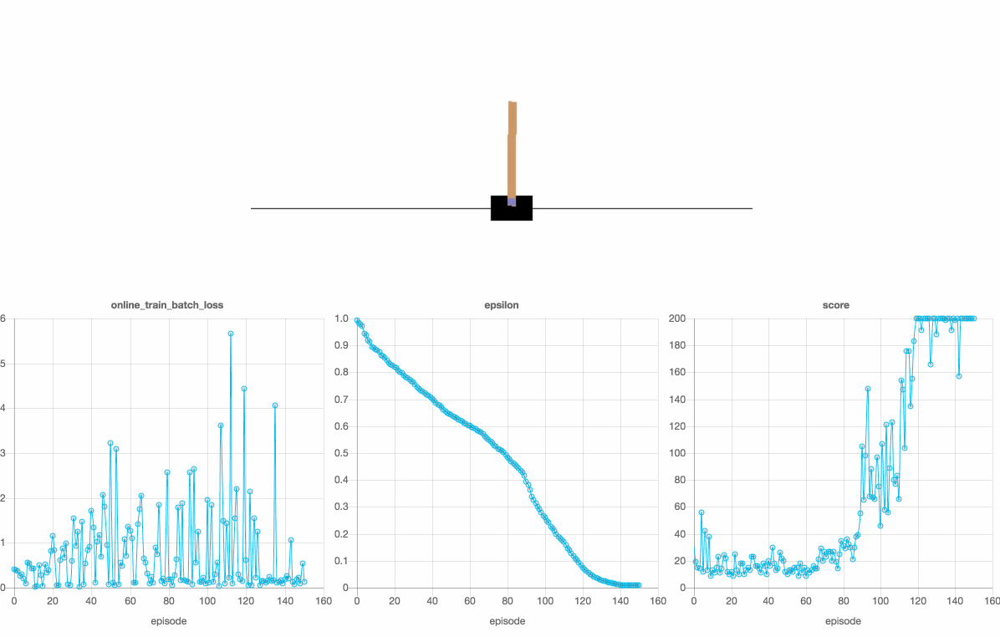

# Gold

Reinforcement Learning in Go



## Quick Start
```
go run ./pkg/v1/agents/deepq/experiments/cartpole/main.go
```

## Requirements
- Go > v12.0
- Docker
- A browser that isn't IE

## Agents
All of the agent implementations can be found in [pkg/v1/agent](./pkg/v1/agent) each agent has an experiments folder providing demos across various environments.

| | |
|---|---|
|[pkg/v1/agent/q](./pkg/v1/agent/q)| [Q Learning](https://en.wikipedia.org/wiki/Q-learning)|
|[pkg/v1/agent/deepq](./pkg/v1/agent/deepq)| [Deep Q learning](https://arxiv.org/abs/1312.5602) with [Double Q](https://arxiv.org/abs/1509.06461)|
|[pkg/v1/agent/reinforce](./pkg/v1/agent/reinforce)| [REINFORCE](http://www-anw.cs.umass.edu/~barto/courses/cs687/williams92simple.pdf) aka Monte Carlo Policy Gradients |
|[pkg/v1/agent/nes](./pkg/v1/agent/nes)| [Natural Evolution Strategies](http://www.jmlr.org/papers/volume15/wierstra14a/wierstra14a.pdf)|
|[pkg/v1/agent/her](./pkg/v1/agent/her)| [Hindsight Experience Replay](https://arxiv.org/pdf/1707.01495.pdf)|
|[pkg/v1/agent/ppo1](./pkg/v1/agent/ppo1)|[Proximal Policy Optimization](https://arxiv.org/pdf/1707.06347.pdf) ⚠️ in progress |

## Inspiration
- OpenAI Baselines https://github.com/openai/baselines
- The Gorgonia Project https://github.com/gorgonia
- RL Overview by Lilian Weng https://lilianweng.github.io/lil-log/2018/02/19/a-long-peek-into-reinforcement-learning.html
- Open Endedness https://www.oreilly.com/radar/open-endedness-the-last-grand-challenge-youve-never-heard-of
- AI-GAs http://www.evolvingai.org/files/1905.10985.pdf 
- The Bitter Lesson http://incompleteideas.net/IncIdeas/BitterLesson.html


## Future Thoughts
- Neural Logic - paper: https://arxiv.org/pdf/1904.10729.pdf
- Neural Episodic Control - paper: https://arxiv.org/pdf/1703.01988.pdf
- Imagination-Augmented Agents - paper: https://arxiv.org/pdf/1707.06203.pdf code: https://github.com/clvrai/i2a-tf release: https://deepmind.com/blog/article/agents-imagine-and-plan
- World Models - paper: https://github.com/clvrai/i2a-tf code: https://github.com/hardmaru/WorldModelsExperiments
- HER - paper: https://arxiv.org/abs/1707.01495 tutorial: 
- Neuroevolution - https://towardsdatascience.com/deep-neuroevolution-genetic-algorithms-are-a-competitive-alternative-for-training-deep-neural-822bfe3291f5
    - https://towardsdatascience.com/reinforcement-learning-without-gradients-evolving-agents-using-genetic-algorithms-8685817d84f
    - https://eng.uber.com/deep-neuroevolution/
    - https://www.oreilly.com/radar/neuroevolution-a-different-kind-of-deep-learning/
- Population Based Policy Gradient - https://designrl.github.io/  https://papers.nips.cc/paper/7785-evolved-policy-gradients.pdf
- NEAT & HyperNEAT - http://blog.otoro.net/2016/05/07/backprop-neat/
- Compositional Pattern-producing Networks - https://towardsdatascience.com/understanding-compositional-pattern-producing-networks-810f6bef1b88
- Multi-agent - https://arxiv.org/abs/1911.10635
- Novelty Search - https://eplex.cs.ucf.edu/papers/lehman_ecj11.pdf
- POET - https://eng.uber.com/poet-open-ended-deep-learning/
- Quality Diversity - https://www.frontiersin.org/articles/10.3389/frobt.2016.00040/full
- Minimal Criterion Coevolution - http://eplex.cs.ucf.edu/papers/brant_gecco17.pdf
- Environment / Ciriculum generation- https://dl.acm.org/doi/abs/10.1145/3205455.3205517
    - Procedural Content Generation - https://arxiv.org/abs/1911.13071
    - Progressive PCG - https://arxiv.org/abs/1806.10729
    - PCG via ML https://arxiv.org/abs/1702.00539
- Neuromodulation - http://www.evolvingai.org/miconi-t-rawal-clune-stanley-2019-backpropamine-training-self
- Coevolutionary Temporal Difference Learning - http://www.cs.put.poznan.pl/mszubert/pub/mscthesis.pdf
- Automatic Goal Generation - https://arxiv.org/pdf/1705.06366.pdf
- Hierarchical Reinforcement Learning - https://thegradient.pub/the-promise-of-hierarchical-reinforcement-learning/
- Graph Neural Networks - https://arxiv.org/abs/1810.09202
- Dynamic HER - https://openreview.net/pdf?id=Byf5-30qFX
- Energy Based HER - https://arxiv.org/pdf/1810.01363.pdf
- Wieght Agnostic Neural Networks - https://arxiv.org/abs/1906.04358
- Improving Evolution Strategies with Generative Neural Networks - https://arxiv.org/pdf/1901.11271.pdf
- ANML neuromodulation - https://arxiv.org/abs/2002.09571
- CMA-ES - https://en.wikipedia.org/wiki/CMA-ES